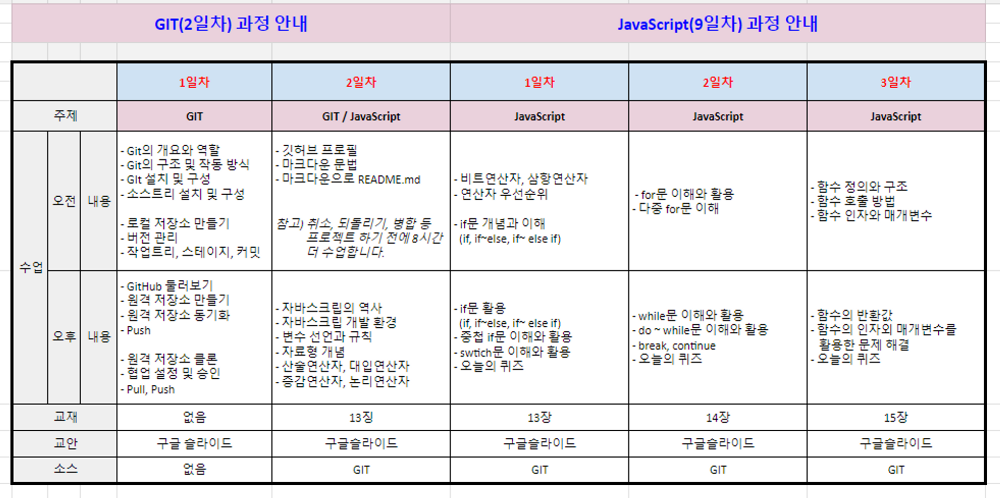

# welcome

# 하는 일:yum:
- 이 곳은 web 관련하여 파일을 올리고 저장하는 공부 공간입니다.

# 학습내용

# 자기소개:smiley:
- (1999.02.12) 이경민 여자
- (5월 30일 - ) 멀티캠퍼스 강의 시작
-  프론트엔드 개발자 준비중
-  본인 블로그[쭝민이네](https://blog.naver.com/tlstj212)

# 공부:collision:
- HTML&CSS
- Javascript
- Git

# 목표:eyes:
***공부를 미루지 않고 열심히 꾸준하게 하자***
> 나폴레옹 - 굳은 결심은 가장 유용한 지식이다.

